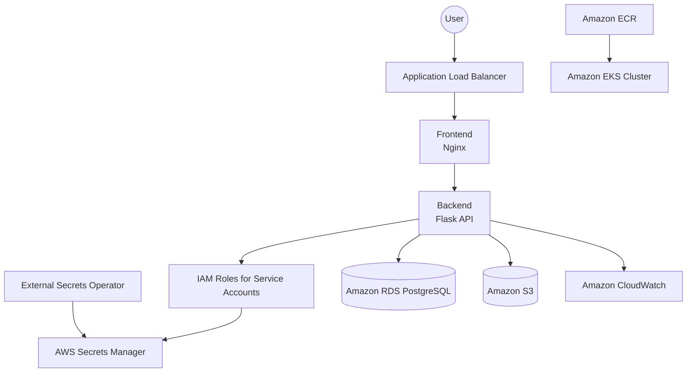
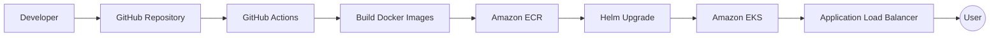

# Employee Directory Platform

> A production-style cloud-native employee management platform built on Amazon Web Services (AWS) using modern DevOps practices.


---

## Overview

The Employee Directory Platform is a production-style cloud-native application that demonstrates how modern DevOps practices can be used to deploy, secure, and operate a Kubernetes-based application on Amazon Web Services.

The platform enables users to manage employee records through a web interface while showcasing enterprise-grade infrastructure provisioning, secure secret management, container orchestration, automated CI/CD, centralized logging, and cloud-native security practices.

The project emphasizes operational reliability, security, and maintainability, reflecting the architecture and deployment patterns commonly used in production environments.

---

## Architecture at a Glance

| Component | Technology |
|-----------|------------|
| Cloud Platform | AWS |
| Compute | Amazon EKS |
| Infrastructure as Code | Terraform |
| Application Packaging | Helm |
| Container Runtime | Docker |
| Database | Amazon RDS PostgreSQL |
| Object Storage | Amazon S3 |
| Secrets | AWS Secrets Manager + External Secrets |
| Authentication | IAM Roles for Service Accounts (IRSA) |
| CI/CD | GitHub Actions |
| Logging | Amazon CloudWatch |
| Ingress | AWS Application Load Balancer |

---

# Project Objectives

This project demonstrates how to:

- Provision AWS infrastructure using Terraform
- Deploy containerized applications on Amazon EKS
- Automate deployments using GitHub Actions
- Build and publish Docker images to Amazon ECR
- Secure workloads using IAM Roles for Service Accounts (IRSA)
- Synchronize secrets using External Secrets Operator
- Store employee photos securely in Amazon S3
- Persist employee records in Amazon RDS PostgreSQL
- Centralize application logs using Amazon CloudWatch
- Implement production-style Kubernetes deployments with Helm

---

# Solution Architecture



---

## Technology Stack

| Category | Technology |
|-----------|------------|
| Cloud Platform | Amazon Web Services (AWS) |
| Infrastructure as Code | Terraform |
| Container Platform | Docker |
| Container Orchestration | Amazon EKS |
| Package Management | Helm |
| Backend | Python Flask |
| Frontend | HTML, JavaScript, Nginx |
| Database | Amazon RDS PostgreSQL |
| Object Storage | Amazon S3 |
| Container Registry | Amazon ECR |
| Secrets Management | AWS Secrets Manager |
| Kubernetes Secrets | External Secrets Operator |
| Authentication | IAM Roles for Service Accounts (IRSA) |
| Logging | Amazon CloudWatch |
| CI/CD | GitHub Actions |

---

# AWS Services

| AWS Service     | Purpose                  | Benefit                             |
| --------------- | ------------------------ | ----------------------------------- |
| Amazon EKS      | Kubernetes orchestration | Highly available container platform |
| Amazon ECR      | Container registry       | Secure image storage                |
| Amazon RDS      | Relational database      | Managed PostgreSQL with backups     |
| Amazon S3       | Object storage           | Durable employee image storage      |
| Secrets Manager | Secret storage           | No credentials in source code       |
| CloudWatch      | Monitoring & logging     | Centralized operational visibility  |

---

# Key Features

- Production-style Kubernetes deployment
- Infrastructure fully provisioned with Terraform
- Containerized frontend and backend services
- Secure database hosted on Amazon RDS
- Employee image storage using Amazon S3
- Secure secret synchronization using External Secrets Operator
- IAM Roles for Service Accounts (IRSA) for least-privilege AWS access
- Automated container builds using GitHub Actions
- Kubernetes deployments managed with Helm
- Centralized logging with Amazon CloudWatch
- Application exposed securely through an AWS Application Load Balancer

---

## Engineering Decisions

This project intentionally follows several cloud-native best practices:

- Infrastructure is managed with Terraform to ensure repeatable and version-controlled deployments.
- IAM Roles for Service Accounts (IRSA) are used instead of static AWS credentials to enforce least-privilege access.
- External Secrets Operator synchronizes secrets from AWS Secrets Manager instead of storing sensitive values directly in Kubernetes.
- Amazon RDS is used instead of a self-managed PostgreSQL deployment to reduce operational overhead.
- Monitoring is disabled by default in the development environment to reduce AWS costs while keeping the Helm chart ready for larger deployments.

---

## Project Highlights

- Provisioned complete AWS infrastructure using Terraform
- Deployed containerized frontend and backend services to Amazon EKS
- Implemented secure workload authentication using IRSA
- Eliminated static Kubernetes secrets through External Secrets Operator
- Configured Application Load Balancer ingress for external access
- Integrated Amazon RDS PostgreSQL for persistent storage
- Stored employee images in Amazon S3
- Automated image builds and deployments using GitHub Actions
- Centralized application logging with Amazon CloudWatch

---

# Repository Structure

```text
employee-app/
├── .github/
│   └── workflows/
│       └── deploy.yml
├── employee-app/
│   ├── backend/
│   ├── frontend/
│   └── README.md
├── helm/
├── terraform/
├── PROJECT.md
└── README.md
```

---

### Directory Overview

| Directory | Purpose |
|-----------|---------|
| **employee-app/backend/** | Python Flask REST API |
| **employee-app/frontend/** | HTML/JavaScript frontend served by Nginx |
| **terraform/** | AWS infrastructure provisioned with Terraform |
| **helm/** | Kubernetes manifests packaged with Helm |
| **.github/workflows/** | GitHub Actions CI/CD workflows |
| **PROJECT.md** | Project planning and implementation notes |
| **docs/** | Architecture diagrams and screenshots (optional) |

---

## Deployment Workflow

The platform follows an automated deployment workflow that promotes consistency and repeatability.


---

## Deployment Process

1. Code is committed and pushed to GitHub.
2. GitHub Actions validates the codebase and builds Docker images.
3. Docker images are pushed to Amazon ECR with versioned tags.
4. Helm updates the Kubernetes deployment with the new image versions.
5. Amazon EKS rolls out the updated application.
6. The Application Load Balancer routes user traffic to the updated services.

---

# Deployment Guide

This guide walks through deploying the Employee Directory Platform from infrastructure provisioning to application verification.

## Prerequisites

Ensure the following tools are installed and configured:

| Tool | Recommended Version |
|------|----------------------|
| AWS CLI | v2.x |
| Terraform | v1.6+ |
| Docker | Latest |
| kubectl | Compatible with EKS cluster |
| Helm | v3.x |
| Git | Latest |

---

## Step 1 – Clone the Repository

```bash
git clone https://github.com/meshackoa/employee-directory-platform.git

cd employee-directory-platform
```

---

## Step 2 – Configure AWS Credentials

Configure the AWS CLI with credentials that have permission to provision and manage the required AWS resources.

Verify the configuration:

```bash
aws sts get-caller-identity --profile terraform
```

---

## Step 3 – Provision Infrastructure

Navigate to the Terraform directory.

```bash
cd terraform
```

Initialize Terraform.

```bash
terraform init
```

Review the execution plan.

```bash
terraform plan
```

Provision the infrastructure.

```bash
terraform apply
```

Terraform provisions resources including:

- Amazon VPC
- Amazon EKS Cluster
- Amazon RDS PostgreSQL
- Amazon S3 Bucket
- Amazon ECR Repositories
- AWS IAM Roles
- AWS Secrets Manager
- Amazon CloudWatch resources

---

## Step 4 – Configure kubectl

Connect kubectl to the newly created EKS cluster.

```bash
aws eks update-kubeconfig \
  --name employee-platform-cluster-dev \
  --region us-east-1 \
  --profile terraform
```

Verify connectivity.

```bash
kubectl get nodes
```

---

## Step 5 – Build Docker Images

Return to the repository root.

```bash
cd ..
```

### Backend
...

```bash
docker build \
  -t employee-backend:latest \
  ./employee-app/backend
```

### Frontend

```bash
docker build \
  -t employee-frontend:latest \
  ./employee-app/frontend
```

---

## Step 6 – Push Images to Amazon ECR

Retrieve your AWS account ID and define the ECR registry.
The Amazon ECR repositories are created during the Terraform provisioning step.

```bash
AWS_ACCOUNT_ID=$(aws sts get-caller-identity \
  --query Account \
  --output text \
  --profile terraform)

AWS_REGION=us-east-1

ECR_REGISTRY="${AWS_ACCOUNT_ID}.dkr.ecr.${AWS_REGION}.amazonaws.com"
```

Authenticate Docker with Amazon ECR.

```bash
aws ecr get-login-password \
  --region $AWS_REGION \
  --profile terraform \
| docker login \
  --username AWS \
  --password-stdin $ECR_REGISTRY
```

Tag the Docker images.

```bash
docker tag employee-backend:latest \
$ECR_REGISTRY/employee-backend:latest

docker tag employee-frontend:latest \
$ECR_REGISTRY/employee-frontend:latest
```

Push the images to Amazon ECR.

```bash
docker push $ECR_REGISTRY/employee-backend:latest

docker push $ECR_REGISTRY/employee-frontend:latest
```

---

## Step 7 – Install Supporting Components

Install External Secrets Operator.

```bash
helm repo add external-secrets https://charts.external-secrets.io

helm repo update

helm install external-secrets \
external-secrets/external-secrets \
-n external-secrets \
--create-namespace
```

Install the AWS Load Balancer Controller.

```bash
helm repo add eks https://aws.github.io/eks-charts

helm repo update

helm install aws-load-balancer-controller eks/aws-load-balancer-controller \
  --namespace kube-system \
  --set clusterName=employee-platform-cluster-dev \
  --set serviceAccount.create=false \
  --set serviceAccount.name=aws-load-balancer-controller \
  --set region=us-east-1
```

Verify the AWS Load Balancer Controller installation.

```bash
kubectl get pods -n kube-system \
-l app.kubernetes.io/name=aws-load-balancer-controller
```

---

## Step 8 – Deploy the Application

Deploy the Helm chart.

```bash
helm install employee-platform \
./helm \
--namespace employee-platform \
--create-namespace
```

If updating an existing deployment:

```bash
helm upgrade employee-platform ./helm
```

---

## Step 9 – Verify the Deployment

Verify the pods.

```bash
kubectl get pods -n employee-platform
```

Verify services.

```bash
kubectl get svc -n employee-platform
```

Verify ingress.

```bash
kubectl get ingress -n employee-platform
```

Retrieve the Application Load Balancer (ALB) DNS name from the Ingress resource and open it in your browser.

```bash
kubectl get ingress \
-n employee-platform
```

Open the ALB URL in a browser.

---

## Step 10 – Validate the Platform

Confirm:

- All pods are in the **Running** state.
- The backend API returns a healthy status.
- The frontend loads successfully.
- Employee records can be created and retrieved.
- Images upload successfully to Amazon S3.
- Logs are visible in Amazon CloudWatch.

---

## Deployment Summary

At the completion of this process:

- AWS infrastructure is provisioned using Terraform.
- Docker images are stored in Amazon ECR.
- Kubernetes workloads are deployed on Amazon EKS.
- Secrets are synchronized from AWS Secrets Manager.
- Employee data is stored in Amazon RDS PostgreSQL.
- Employee images are stored in Amazon S3.
- The application is accessible through an AWS Application Load Balancer.

---

# CI/CD Pipeline

The platform uses GitHub Actions to automate the build and deployment process.

| Stage | Action |
|--------|--------|
| Checkout | Pull repository source code |
| Build | Build backend and frontend Docker images |
| Publish | Push versioned Docker images to Amazon ECR |
| Deploy | Deploy updated images to Amazon EKS using Helm |
| Verify | Kubernetes performs a rolling update and health checks |

---

# Security Implementation

| Security Control | Implementation |
|------------------|----------------|
| Secrets Management | AWS Secrets Manager |
| Kubernetes Secrets | External Secrets Operator |
| Authentication | IAM Roles for Service Accounts (IRSA) |
| Container Registry | Amazon ECR |
| Database | Amazon RDS PostgreSQL |
| Object Storage | Amazon S3 |
| Application Access | AWS Application Load Balancer |

---

# Monitoring & Logging

## Monitoring

- Amazon CloudWatch
- Kubernetes pod health
- Application Load Balancer health checks
- Deployment status

## Logging

- Amazon CloudWatch
- Kubernetes logs (`kubectl logs`)
- Application logs

---

# Troubleshooting & Lessons Learned

| Challenge | Resolution |
|------------|------------|
| Backend CreateContainerConfigError | Corrected External Secrets configuration and synchronized Kubernetes secrets |
| IRSA trust policy mismatch | Updated the IAM trust relationship to match the service account namespace |
| External Secrets synchronization | Corrected SecretStore configuration and verified successful secret synchronization |
| ALB health check failures | Changed the health check path from `/` to `/api/health` |
| Pod scheduling issues | Temporarily increased the node group size to provide sufficient cluster capacity |
| Terraform planned unintended RDS password rotation | Reviewed the execution plan and adjusted configuration to prevent unnecessary database changes |